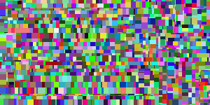
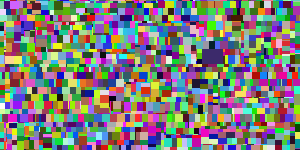

# Mondrian Art !!

This is the typescript solution for the Mondrian task given in Stanford University. Original question paper can be found [here](http://nifty.stanford.edu/2018/stephenson-mondrian-art/).

**[Live Demo](https://parikhmeet.github.io/mondrian/)**

## Sample Output

## Configurations

Mondrian class has three variables which can be tweaked to produce different Art. The description for each are mentioned below.

- **LineWidth**: The border width for each rectangles.
- **MinimumSpacing**: Defines how small can be rectangle be. This is the minimum spacing between parallel sides of the rectangle.
- **SmallRectProbability**: Defines the chances of breaking the rectangle further. Lower value leads to higher chances of bigger rectangles.

## Note

- Bulma and JQuery library are included but are actually not required. They can be easily removed by simple tweaking. However I have kept them so that this project can also serve as a scaffolding project.
